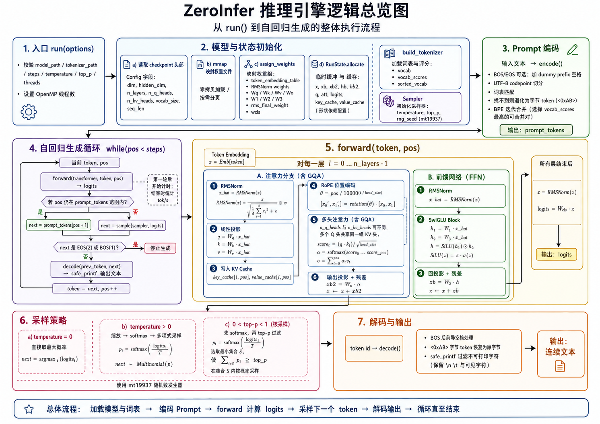

# ZeroInfer.cpp

ZeroInfer.cpp 是一个使用 C++17 编写的轻量级 Llama 2 CPU 推理引擎，思路来源于[llama2.c](https://github.com/karpathy/llama2.c)，当前支持：

- mmap 权重加载
- BPE Tokenizer
- RMSNorm、RoPE、GQA Attention 和 SwiGLU FFN
- KV cache
- temperature、top-p 和贪心采样
- 可复现的随机种子
- OpenMP 并行矩阵向量乘法
- CMake 静态库与命令行程序

## 模型结构



模型采用 decoder-only Transformer，自回归地根据已有 token 预测下一个 token。输入文本首先经过 Tokenizer 转换为 token id，再通过词嵌入表得到隐藏状态：

$$
x_0 = E[t]
$$

其中 $E$ 是词嵌入矩阵，$t$ 是当前 token id。隐藏状态依次通过若干Transformer 层，每层由带残差连接的注意力子层和前馈网络子层组成：

$$
x' = x + \operatorname{Attention}(\operatorname{RMSNorm}(x))
$$

$$
x_{\text{next}} =
x' + \operatorname{FFN}(\operatorname{RMSNorm}(x'))
$$

RMSNorm 根据向量的均方根进行归一化，并乘以可学习权重：

$$
\operatorname{RMSNorm}(x)_i =
w_i\frac{x_i}{\sqrt{\frac{1}{d}\sum_{j=1}^{d}x_j^2+\epsilon}}
$$

注意力子层首先将隐藏状态投影为 Query、Key 和 Value：

$$
Q=W_Qx,\qquad K=W_Kx,\qquad V=W_Vx
$$

RoPE 将位置信息编码到 Query 和 Key 中。随后使用缩放点积注意力计算当前
token 对历史 token 的权重：

$$
\operatorname{Attention}(Q,K,V)=
\operatorname{softmax}\left(\frac{QK^\mathsf{T}}{\sqrt{d_h}}\right)V
$$

其中 $d_h$ 是单个注意力头的维度。推理时历史 Key 和 Value 存入 KV cache，生成下一个 token 时无需重复计算。模型支持 GQA，即多个 Query 头可以共享一组 Key/Value 头。

前馈网络使用 SwiGLU：

$$
\operatorname{FFN}(x)=
W_2\left(\operatorname{SiLU}(W_1x)\odot(W_3x)\right)
$$

经过所有 Transformer 层后，模型执行最终 RMSNorm，并通过分类矩阵得到
词表上的 logits：

$$
\text{logits}=W_{\text{cls}}\operatorname{RMSNorm}(x)
$$

logits 经过 temperature 和 softmax 转换为概率分布，再使用贪心或 top-p
采样得到下一个 token。该 token 会继续进入模型，形成自回归生成循环。

## 项目结构

```text
.
├── CMakeLists.txt
├── include/zeroinfer/zeroinfer.h  # 核心库公开接口
├── src/internal/ops.h              # 可独立测试的内部算子接口
├── src/internal/ops.cpp            # matmul、RMSNorm 和 softmax
├── src/zeroinfer.cpp              # 推理引擎实现
├── main.cpp                       # CLI 参数解析和程序入口
└── tokenizer.bin                  # Tokenizer 数据
```

## 构建

需要支持 C++17 和 OpenMP 的 C++ 编译器，以及 CMake 3.16 或更高版本。

```bash
cmake -S . -B build -DCMAKE_BUILD_TYPE=Release
cmake --build build -j
```

构建后会生成两个目标：

- `zeroinfer`：静态推理库
- `llama_infer`：命令行程序

## 测试

项目使用 CTest 运行内部算子单元测试：

```bash
ctest --test-dir build --output-on-failure
```

当前测试覆盖非方阵 matmul、RMSNorm 参考值与原地计算，以及 softmax
参考值和大 logits 下的数值稳定性。配置 CMake 时传入
`-DBUILD_TESTING=OFF` 可以关闭测试目标。

### PyTorch 数值对齐

项目提供可选的 PyTorch 对齐测试。Python 负责生成固定的 float32 输入，
C++ runner 执行项目中的真实算子，最后由 PyTorch 计算参考结果并报告
最大绝对误差和平均绝对误差。该流程覆盖多个形状的 matmul、RMSNorm 和
softmax，其中包括接近模型实际维度的 `768 x 288` 矩阵向量乘法。

推荐使用已验证的 `tmp3.12` conda 环境：

```bash
conda activate tmp3.12

cmake -S . -B build-pytorch \
  -DCMAKE_BUILD_TYPE=Release \
  -DZEROINFER_ENABLE_PYTORCH_ALIGNMENT=ON \
  -DPython3_EXECUTABLE="$CONDA_PREFIX/bin/python"

cmake --build build-pytorch -j
ctest --test-dir build-pytorch -R pytorch --output-on-failure
```

PyTorch 对齐默认关闭，因此普通 C++ 单元测试不会依赖 Python、NumPy 或
PyTorch。

在 Python 3.12.13、PyTorch 2.10.0 和 NumPy 2.2.6 的 CPU 环境中，当前
固定测试数据的对齐结果如下：

| 算子 | 测试用例数 | 最大绝对误差 |
| --- | ---: | ---: |
| matmul | 3 | `3.34e-6` |
| RMSNorm | 3 | `7.15e-7` |
| softmax | 3 | `1.79e-7` |

全部 9 个对齐用例均通过。不同 CPU、编译器和 PyTorch 版本可能因
float32 归约顺序不同而产生轻微误差变化。

## 运行

```bash
./build/llama_infer \
  --model stories15M.bin \
  --tokenizer tokenizer.bin \
  --prompt "Long long ago" \
  --steps 128 \
  --temperature 0.8 \
  --top-p 0.9 \
  --threads 8 \
  --seed 233333
```

查看完整帮助：

```bash
./build/llama_infer --help
```

## 命令行参数

| 参数 | 说明 | 默认值 |
| --- | --- | --- |
| `--model PATH` | 模型 checkpoint 路径 | `stories15M.bin` |
| `--tokenizer PATH` | Tokenizer 文件路径 | `tokenizer.bin` |
| `--prompt TEXT` | 输入提示词 | `Long long ago` |
| `--steps N` | 总 forward 步数，`0` 表示使用模型最大序列长度 | `0` |
| `--temperature VALUE` | 采样温度，`0` 表示贪心采样 | `0.95` |
| `--top-p VALUE` | top-p 核采样阈值，范围为 `[0, 1]` | `0.9` |
| `--threads N` | OpenMP 线程数，`0` 表示使用运行时默认值 | `0` |
| `--seed N` | 随机种子 | `233333` |
| `-h`, `--help` | 显示帮助信息 | - |

相同模型、参数和随机种子会产生相同的采样序列。

## 模型

当前已验证以下 TinyStories checkpoint：

| 模型 | dim | hidden dim | 层数 | 词表大小 | 最大序列长度 | 当前状态 |
| --- | ---: | ---: | ---: | ---: | ---: | --- |
| `stories15M.bin` | 288 | 768 | 6 | 32000 | 256 | 可运行 |
| `stories42M.bin` | 512 | 1376 | 8 | 32000 | 1024 | 可运行 |
| `stories110M.bin` | 768 | 2048 | 12 | 32000 | 1024 | 可运行 |

模型文件体积较大，不提交到 Git。如需下载请参考[llama2.c](https://github.com/karpathy/llama2.c)
